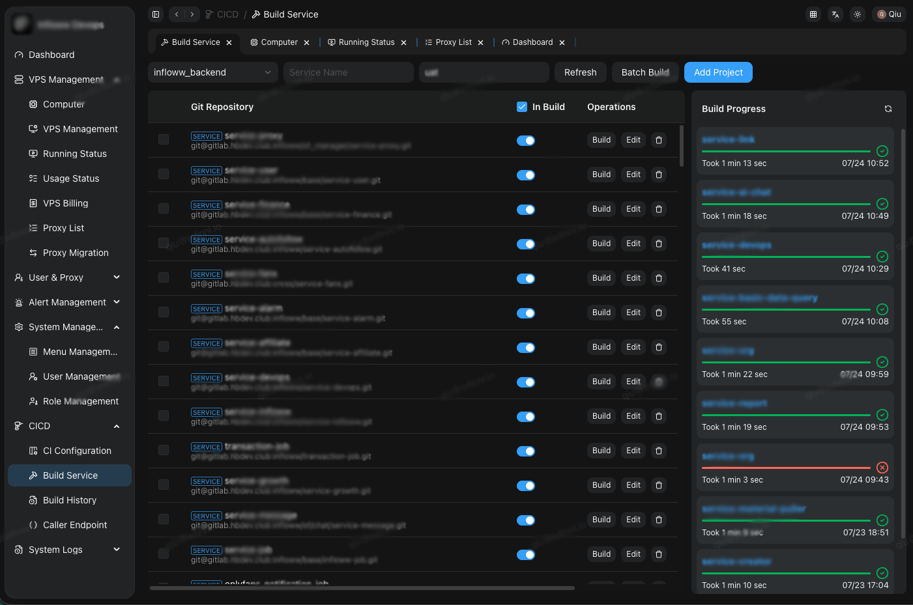

# Kui Vue Admin

基于Vue.js的后台管理模板, 开箱即用, 快速构建后台管理系统.

- Vue3 + Kui Vue + Typescript
- 多主题(Light / Dark)
- 多语言
- Pinia 状态管理
- 自动路由
- 内置常用组件


# Demo 



# 开发

```sh
git clone https://github.com/smallerqiu/kui-vue-admin.git
cd kui-vue-admin
pnpm i
pnpm start
```