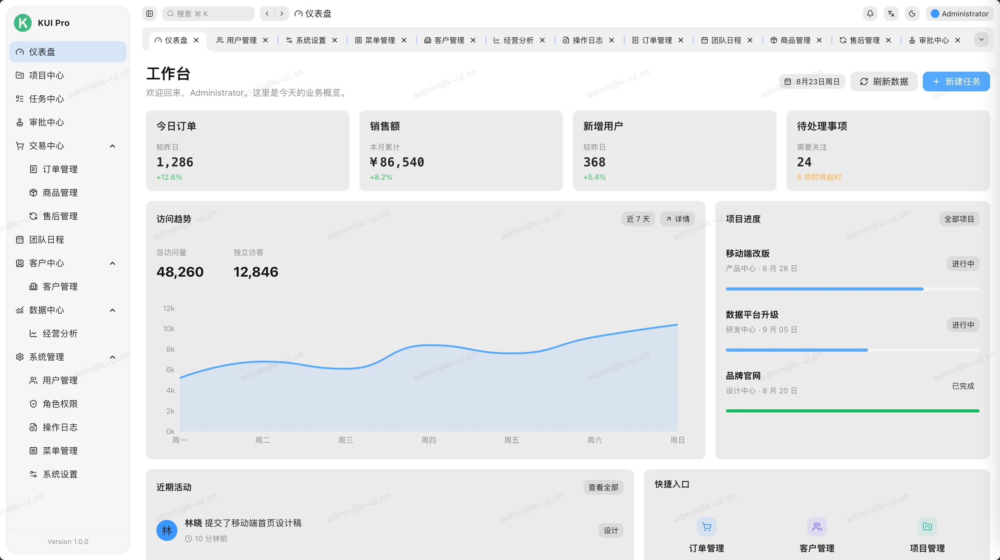
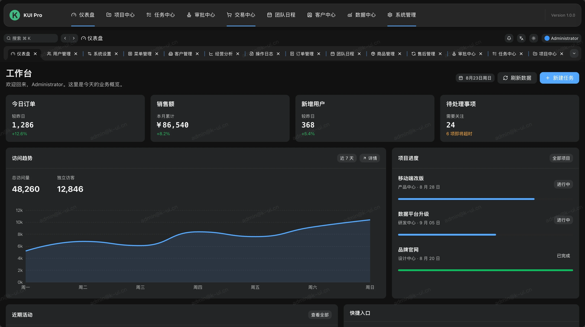
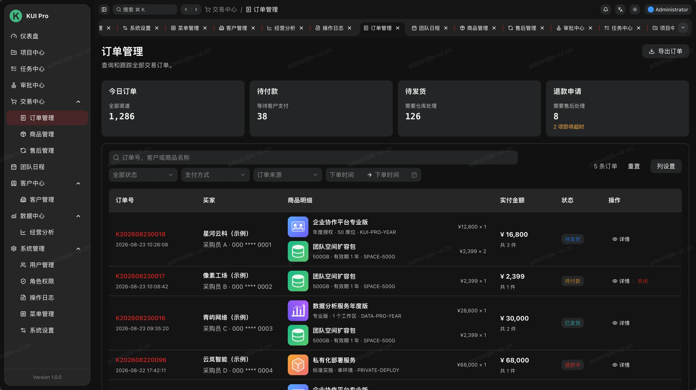

# KUI Vue Pro

> v1.0.0 · 基于 KUI Vue 的企业级中后台解决方案

基于 Vue 3、TypeScript 和 KUI Vue 的企业级后台解决方案。项目包含完整的应用外壳、权限体系和常见业务页面，可作为中后台项目的开发起点。

## 界面预览



<table>
  <tr>
    <td width="50%"></td>
    <td width="50%"></td>
  </tr>
  <tr>
    <td align="center">深色主题与顶部导航</td>
    <td align="center">订单管理</td>
  </tr>
</table>

## 功能

- 响应式工作台、深浅主题和移动端侧栏
- 文件路由、多页签、面包屑和全局菜单搜索
- 登录、会话刷新、路由/菜单/按钮权限和数据范围控制
- 侧栏、顶部、混合三种布局模式
- 订单、售后、商品、客户、用户、角色和菜单管理
- ECharts 经营分析与访问趋势
- 通知中心、操作日志和系统设置
- 本地 Mock、Vitest、Playwright E2E 与 GitHub Actions CI

## 技术栈

- Vue 3 + TypeScript + Vite
- KUI Vue + KUI Icons
- Pinia + Vue Router
- ECharts + Vue ECharts
- Vitest + jsdom
- Playwright

## 快速创建

```bash
npm create kui-vue-pro@latest my-app
cd my-app
pnpm install
pnpm dev
```

也可以使用 pnpm 或 Yarn：

```bash
pnpm create kui-vue-pro my-app
yarn create kui-vue-pro my-app
```

## 仓库开发

```bash
git clone https://github.com/smallerqiu/kui-vue-admin.git
cd kui-vue-admin
pnpm install
cp .env.example .env.local
pnpm dev
```

演示账号：`admin@k-ui.cn` / `123456`。

## 环境变量

| 变量                   | 默认值                  | 说明                     |
| ---------------------- | ----------------------- | ------------------------ |
| `VITE_APP_NAME`        | `KUI Vue Pro`           | 应用完整名称             |
| `VITE_APP_SHORT_NAME`  | `KUI Pro`               | 侧栏简称                 |
| `VITE_APP_DESCRIPTION` | -                       | 应用描述                 |
| `VITE_API_BASE_URL`    | `/api`                  | API 请求前缀或完整地址   |
| `VITE_SITE_URL`        | `https://admin.k-ui.cn` | 部署地址                 |
| `VITE_APP_VERSION`     | `1.0.0`                 | 页面展示的版本号         |
| `VITE_USE_MOCK`        | `true`                  | 是否使用内置演示登录数据 |

## 权限模型

路由可声明 `roles` 和 `permissions`，同一份配置会同时用于路由守卫与菜单过滤；操作按钮可使用权限指令：

```vue
<Button v-permission="'order:close'">关闭订单</Button>
```

登录用户支持 `all`、`department`、`self` 三种数据范围。业务 API 返回数据后，可使用 `filterByDataScope` 统一收口演示数据；生产环境仍应由服务端执行最终的数据权限校验。

## API 与 Mock

所有请求通过 `src/utils/request.ts` 发起。遇到 401 时会使用 refresh token 刷新会话，并自动重放一次原请求；并发 401 只会触发一次刷新。

开发和在线演示默认启用本地 Mock。接入后端时设置：

```env
VITE_USE_MOCK=false
VITE_API_BASE_URL=https://api.example.com
```

## 布局与国际化

在“系统管理 → 系统设置”中可切换侧栏、顶部和混合布局，配置会保存在浏览器中。应用外壳、路由标题和通用操作支持简体中文/英文切换；业务页面文案可继续按 `src/lang` 的同一机制扩展。

## 质量检查

```bash
pnpm typecheck
pnpm test
pnpm test:e2e
pnpm build
```

也可运行 `pnpm check` 同时执行类型检查和单元测试。E2E 会自动启动本地开发服务，并使用系统 Chrome 执行登录和核心页面冒烟测试。

## 部署

构建产物位于 `dist`：

```bash
pnpm build
```

仓库提供了 [Dockerfile](./Dockerfile) 和 [Nginx 配置](./deploy/nginx.conf)。Nginx 已包含 SPA history fallback；部署时请将 `/api/` 的上游地址替换为实际后端服务。

生产环境建议关闭 Mock、使用 HTTPS、由后端签发短期 access token 和可轮换 refresh token，并在服务端再次校验角色、权限与数据范围。

## 在线预览与版本

- 在线预览：<https://admin.k-ui.cn>
- 当前版本：`1.0.0`
- 更新记录：[CHANGELOG.md](./CHANGELOG.md)
